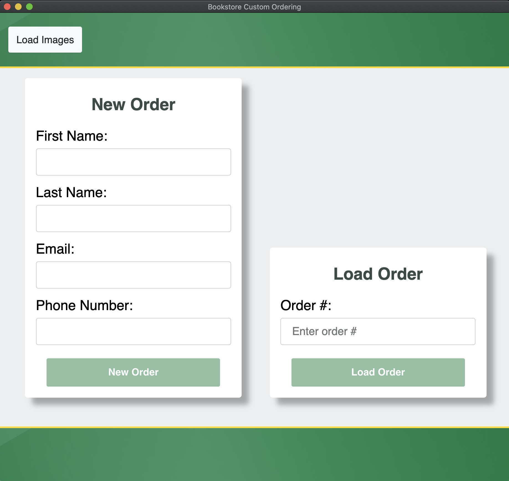
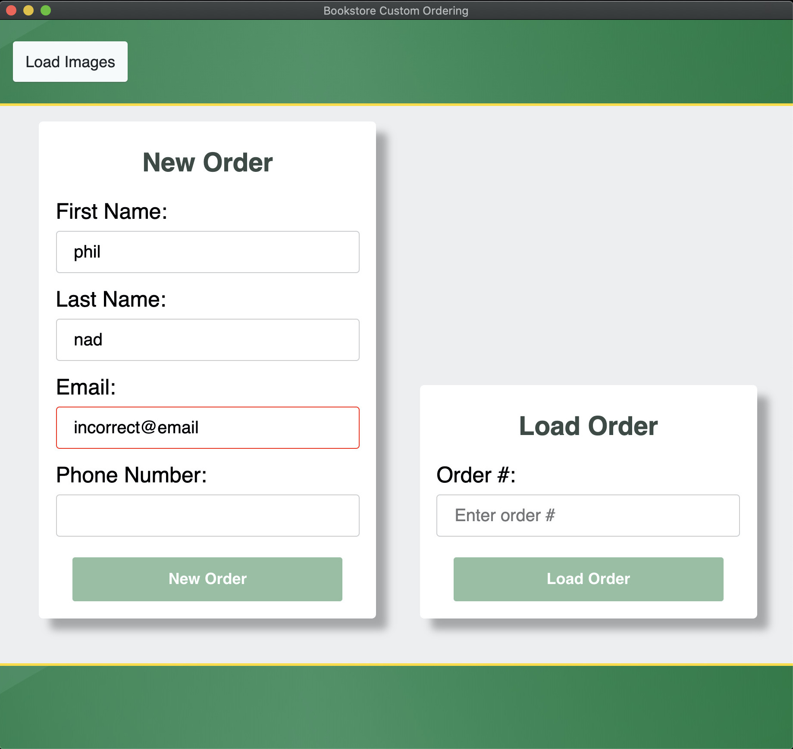
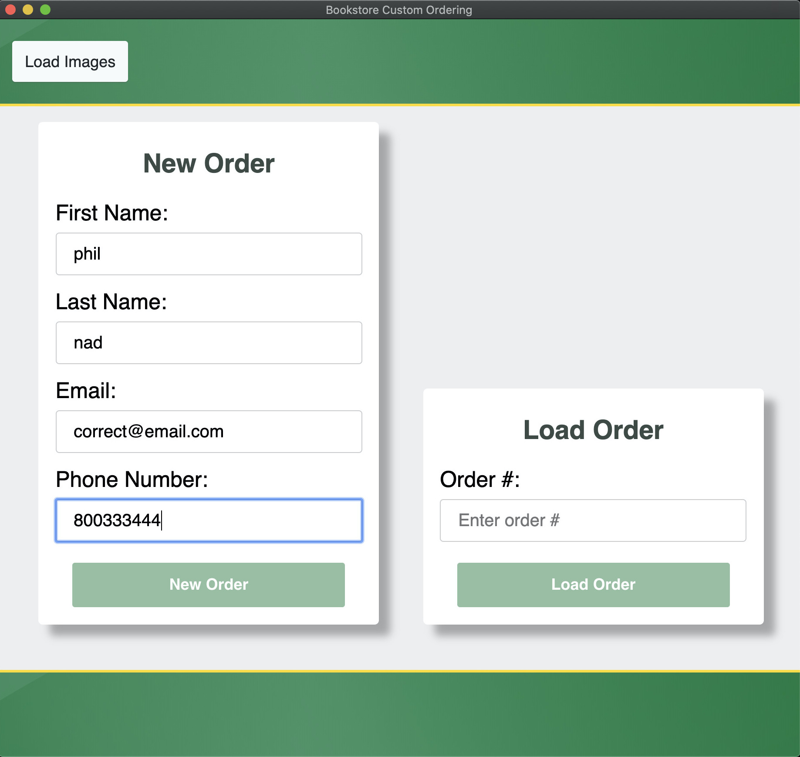
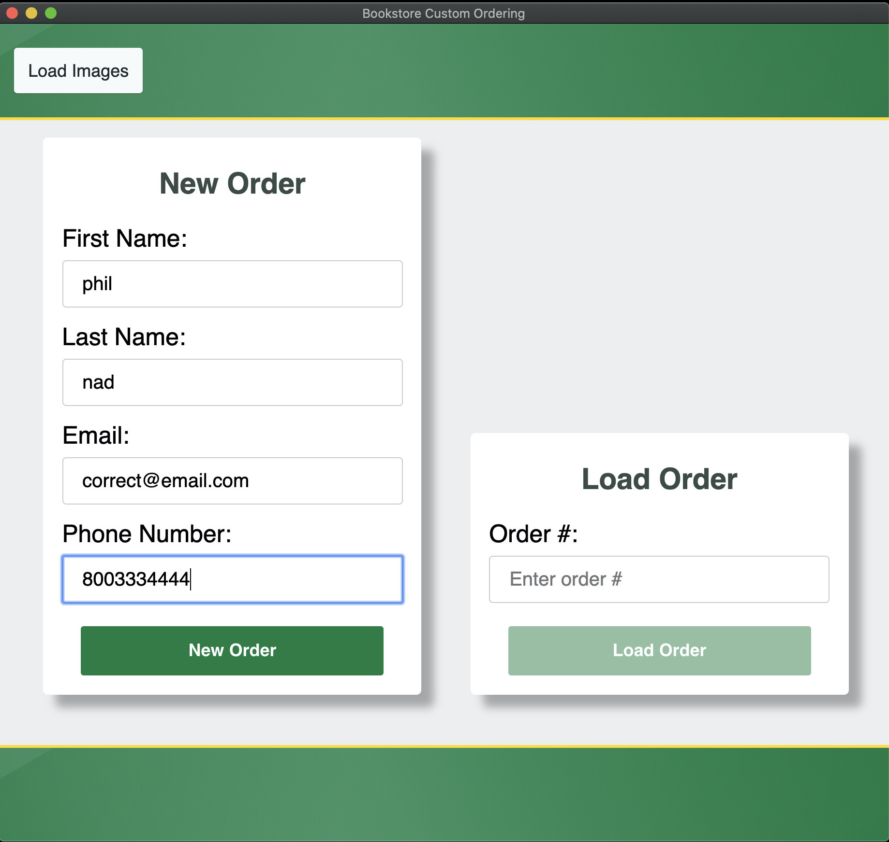

# Creating a New Order

A new order can be created by filling out the information on the `Welcome` page, and then pressing `New Order`. The app will then send request that the `Google Sheet` appends a new row to the `Orders` section, and then fill in the contact information provided, as well as the date the order was first created.

Keep in mind that the app will prevent the user from proceeding from the `Welcome` page until they have correctly entered their information.

