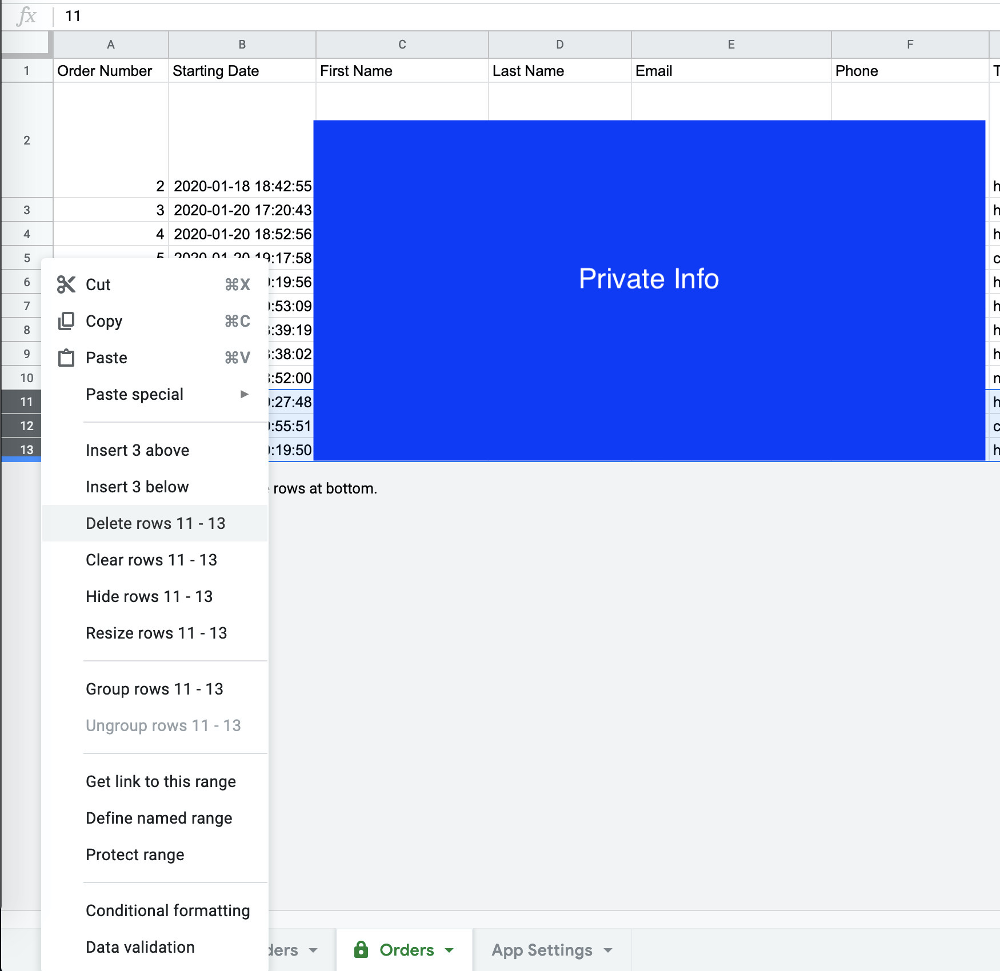

# Deleting an Order

The app does not offer any functionality for deleting an order. The reason is that there is little to no reason to delete an order (as `Google Sheets` does not really offer a realistic limit on entries), however the functionality is still there within `Google Sheets`. To delete a row or values in a cell, simply select the rows, right-click and select delete. 

**WARNING: IF YOU WANT TO REUSE ORDER NUMBERS, MAKE SURE TO DELETE THE ROWS THEMSELVES, OTHERWISE IF YOU SIMPLY WISH TO REMOVE INFORMATION BUT NOT REUSE THE ROWS, THEN ONLY DELETE THE CONTENT WITHIN THE ROWS**

**WARNING: DO NOT DELETE ORDER #2, IT HOLDS THE FUNCTION FOR POPULATING THE ROW / ORDER NUMBERS, WHICH ALLOWS YOU TO TRACE ORDERS IN THE COMPLETED ORDER SECTION BACK TO THE ORDERS SECTION**

