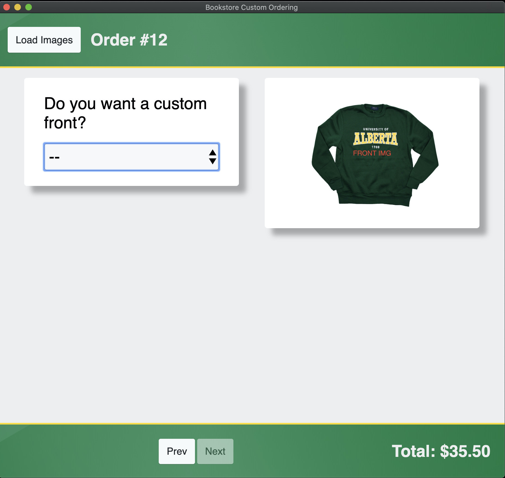
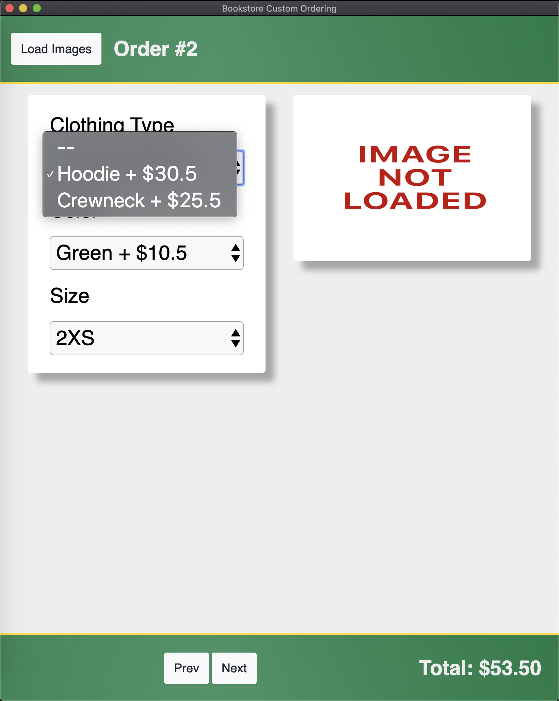
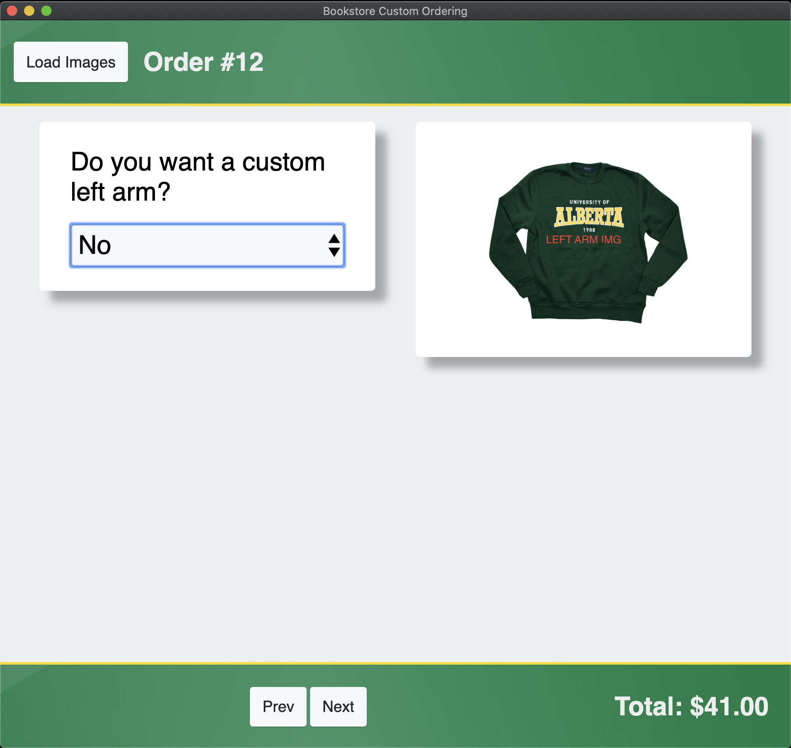
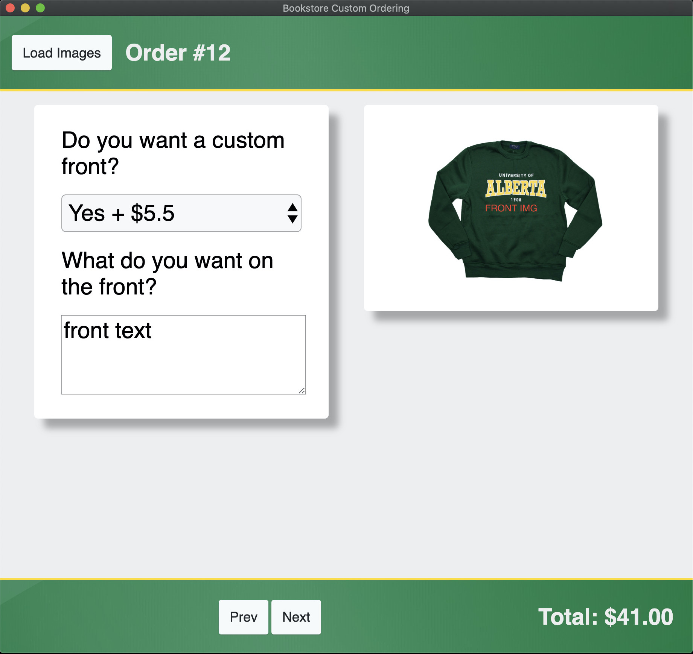
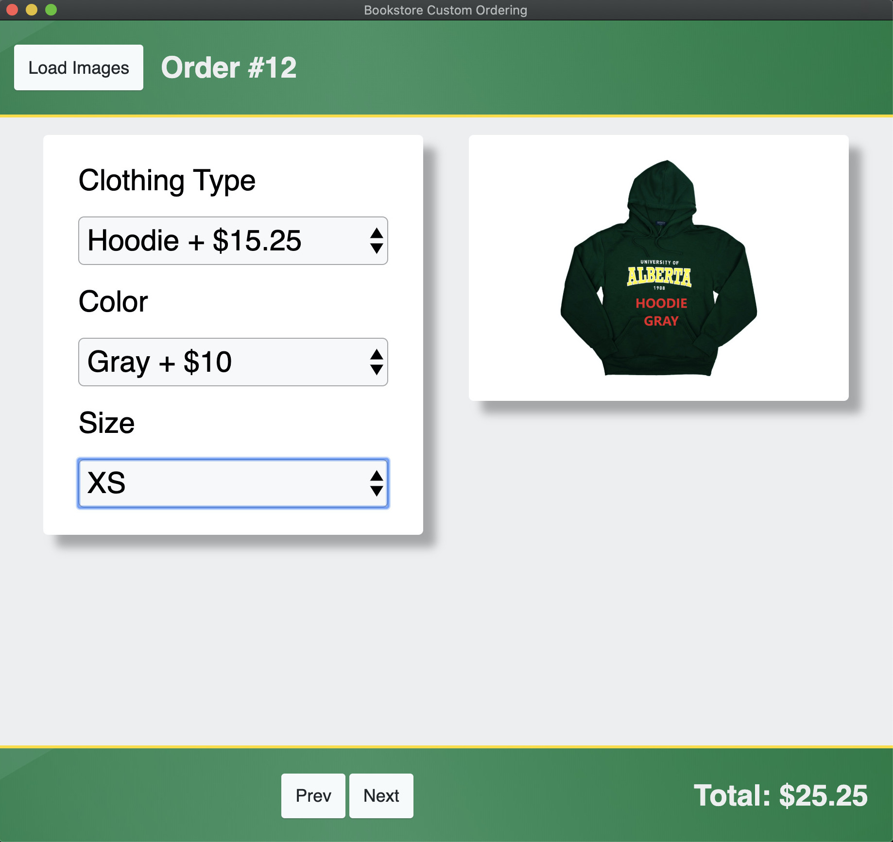
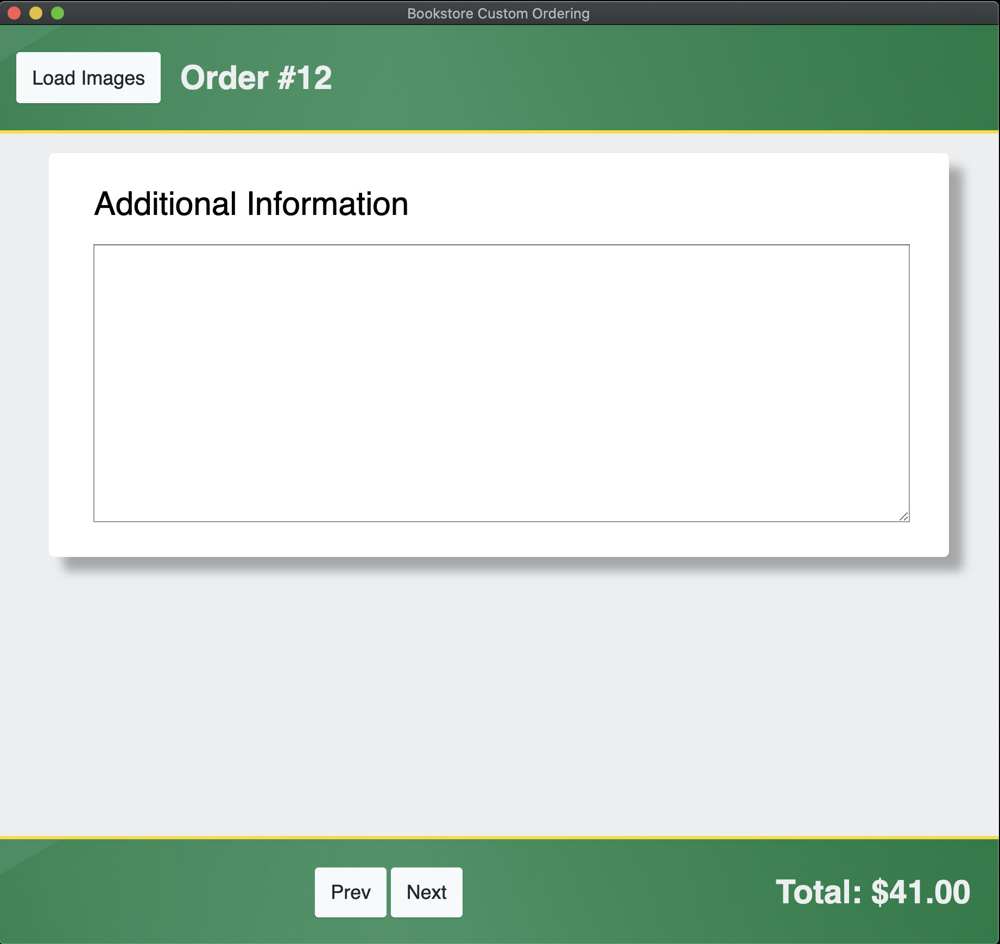

# Editing an Order

To progress through the pages, the user must select whether they wish to have each customization. If they select nothing, the `Next` button is greyed out and they cannot proceed.

To proceed, they must an option in the dropdown menu, and then enter information in the text field (if applicable).

In the case of the section with the type, color, and size selections, the image will automatically update depending on the selection.

Finally, the user will arrive at the `Additional Information` page, where they may fill out any extra comments they wish to add.

