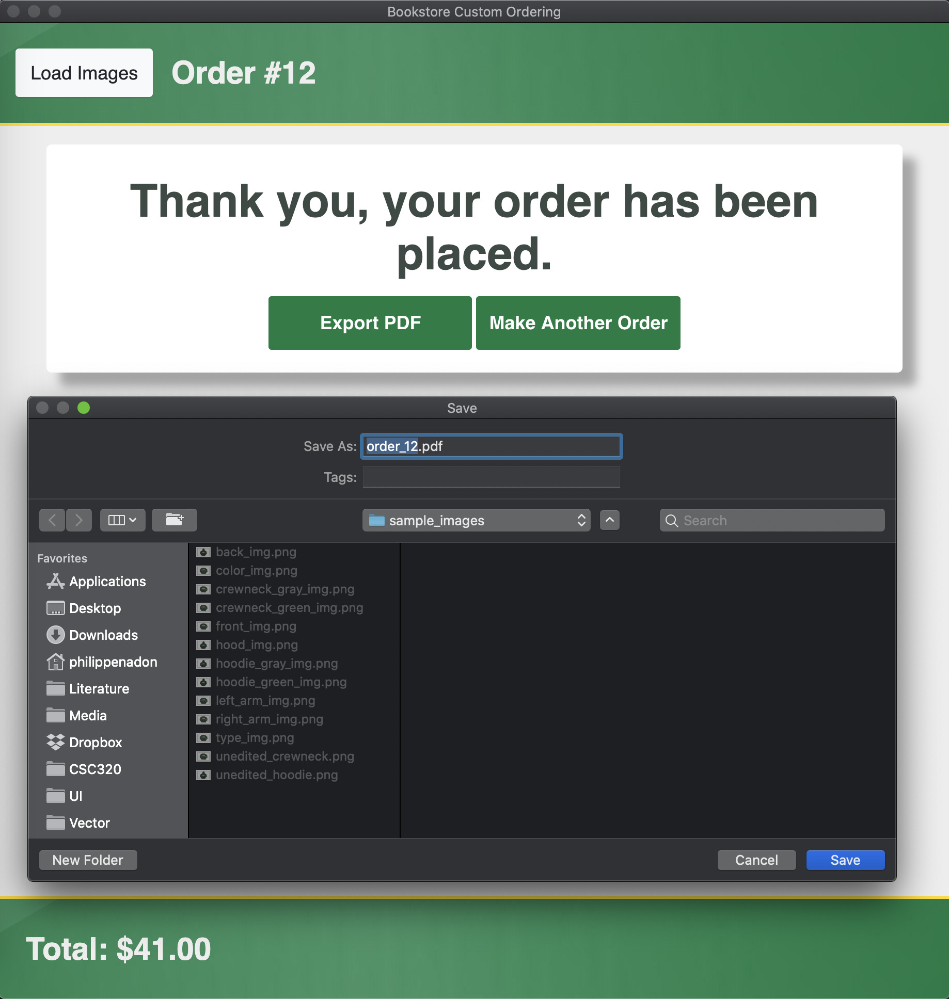
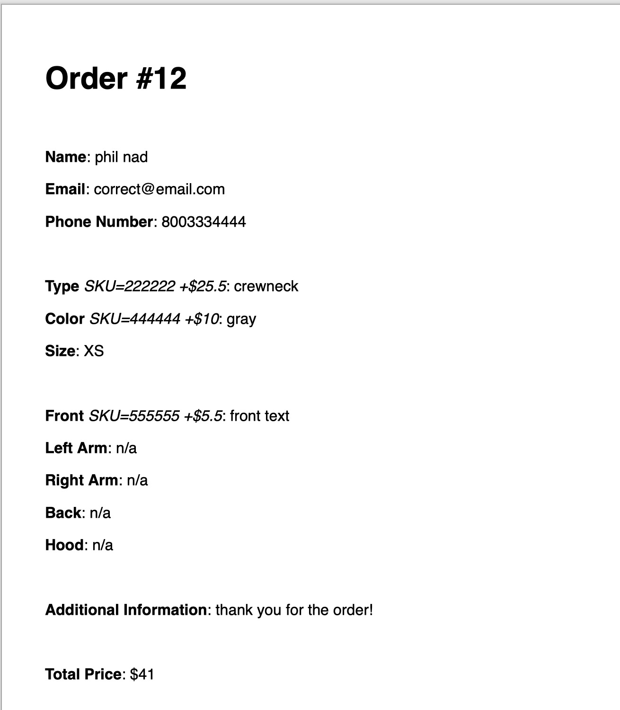

# Export PDF

See `The Summary Page` for information provided in the PDF, it is essentially identical aside from the format. The `Export PDF` option is found in the `Thank You` page, which is loaded after a user has pressed `Submit Order` in the `Summary` page. The `Export PDF` option opens a dialog where you can save the summary in PDF form on your computer. The PDF option is useful for printing or otherwise sending to others to see.

This is how the PDF will appear:

