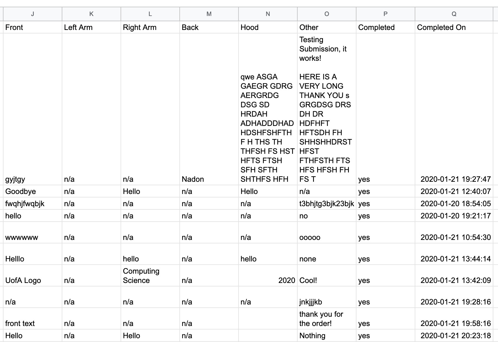
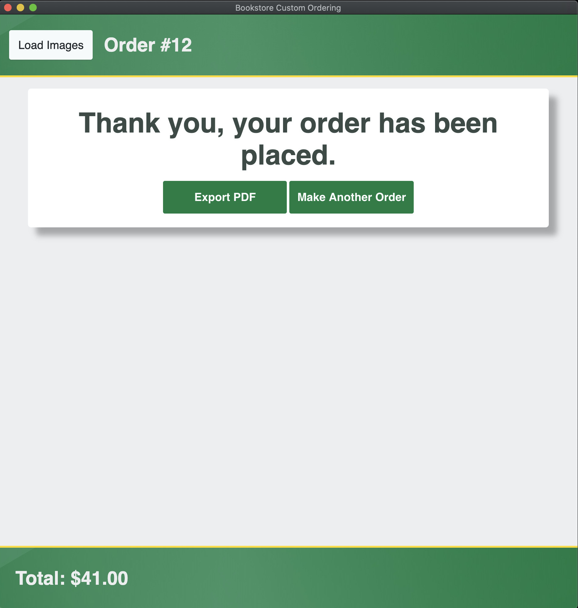

# Finalizing / Submitting an Order

An order can be finalized by pressing the `Submit Order` button in the `Summary` page. The app will send the order's information to `Google Sheets`, as well as enter the date the order was completed as well as a `yes` in the `Completed` column to signify that the order has been completed.

Afterwards the user is brought to the `Thank You` page, where they may make a new order, or export their order information to PDF

