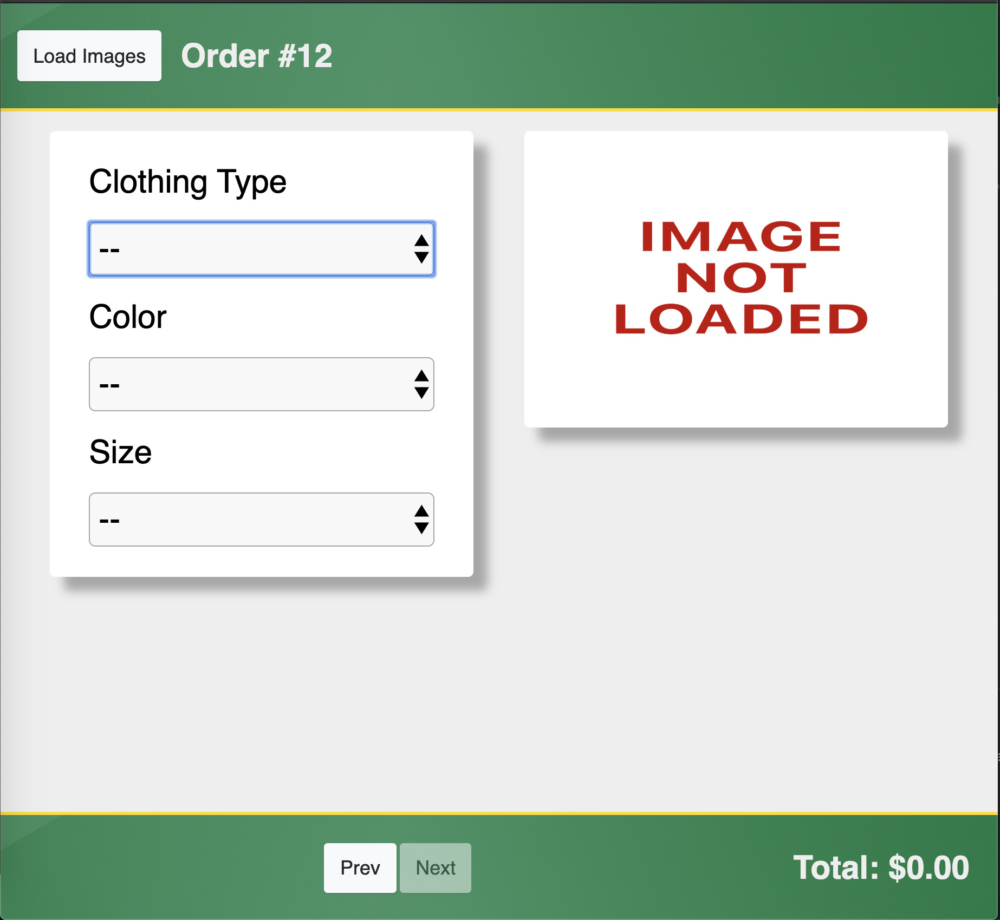
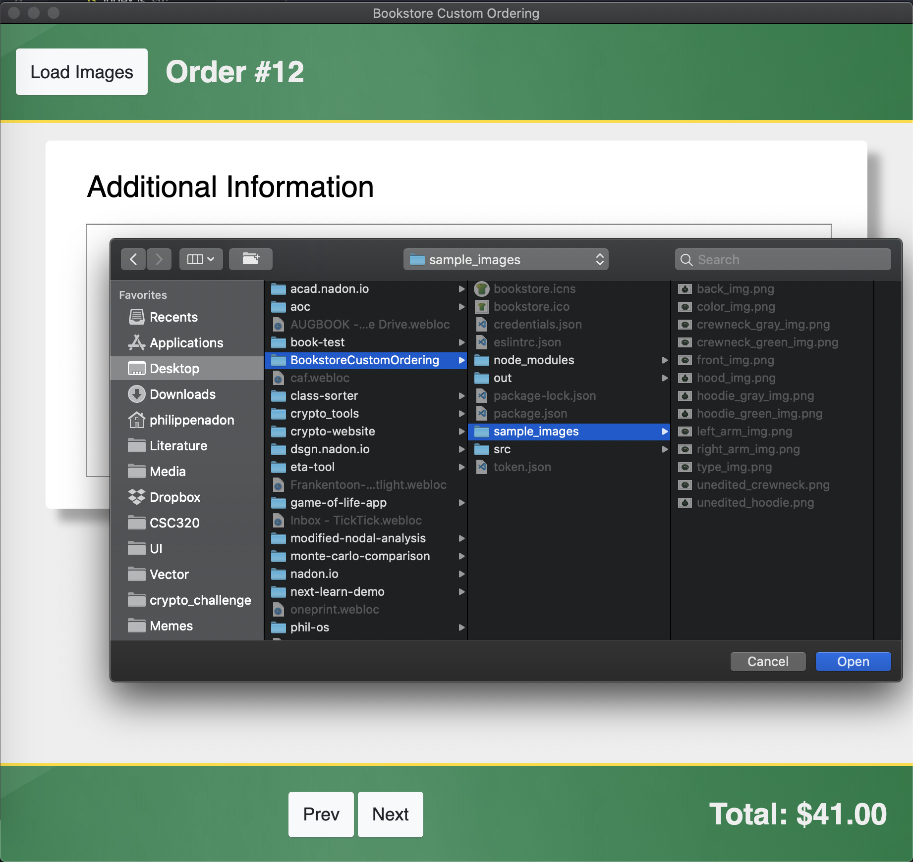

# Images

The images used in the app are loaded automatically at startup. The does this by searching for the images in the folder you have specified, if any. The files must be named in a specific manner for the app to detect them correctly. If the folder is moved or deleted the app will not be able to find the images, and a default `error image` will be placed instead. To ensure that the app reliably loads the images every launch, make sure not to move the folder where the images are stored.

To change the folder where the app looks for the images, click the button at the top-left which says `Load Images` and select the desired folder where the images are stored.

