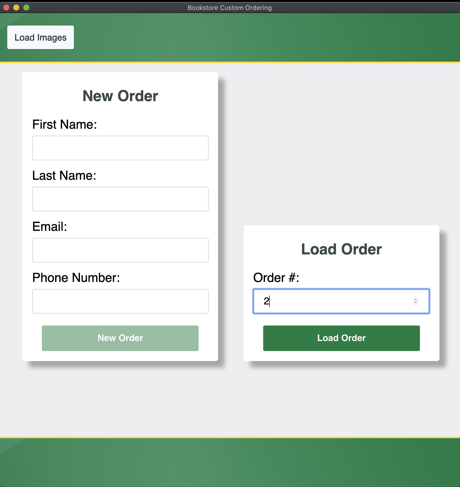

# Loading a Previous Order

A previous order can be loaded by going to the `Welcome` page, and entering the number corresponding to the row/order number that the user wishes to load into the input field that says `Enter order #`. Afterwards, press the `Load Order` button and within a few seconds you should see the app transition to the next page, with all of the information in that row populated within the app's inputs.

