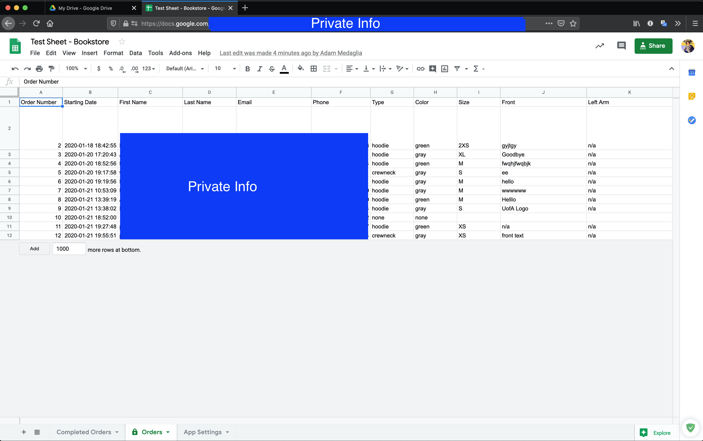

# Managing Orders

Orders can be created, edited, and deleted using a combination of the app and `Google Sheets`. Technically, all order information can be managed from `Google Sheets`, the app simply adds an extra layer of visuals, confirmation, and interaction with your order.

All order information is sent to the `Orders` section of the `Google Sheet`.

**IT IS NOT RECOMMENDED THAT YOU MODIFY THE ORDERS SECTION IN ANY WAY**

