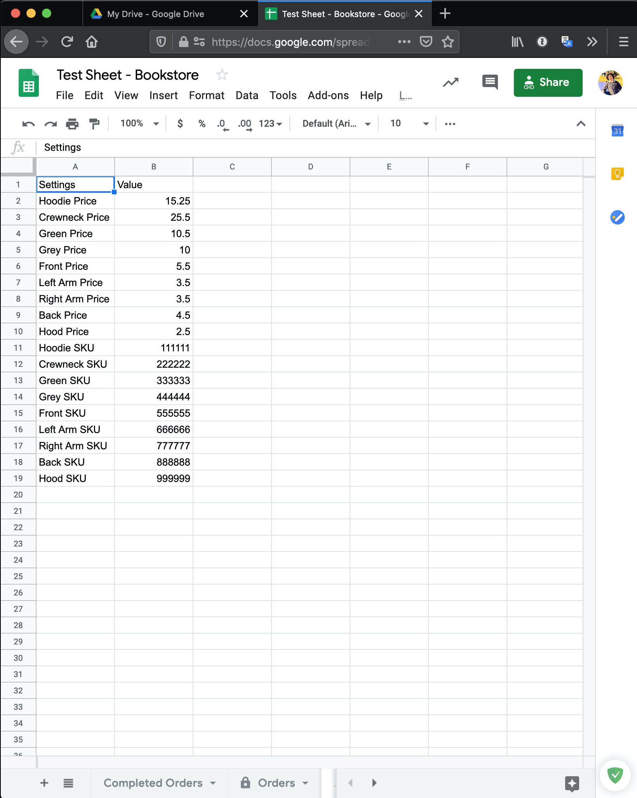

# Prices

To modify the prices associated with each customizable section, open the `Google Sheet` which is linked to the app. At the bottom, you can see 3 sections labelled `Completed Orders`, `Orders`, and `App Settings`. Click `App Settings` and you should see two columns; one with a `Settings` header and another with a `Value` header. The cells in the `Value` column are the values associated with the thing in the `Settings` column. For example, if you wish to modify the price for the front of an article of clothing, you would modify the cell immediately to the right of the cell under `Settings` that contains `Front Price`. This change should take effect once the app reloads.

*WARNING: PRICES CAN ONLY BE NUMBERS, DO NOT ADD SYMBOLS OR LETTERS*

