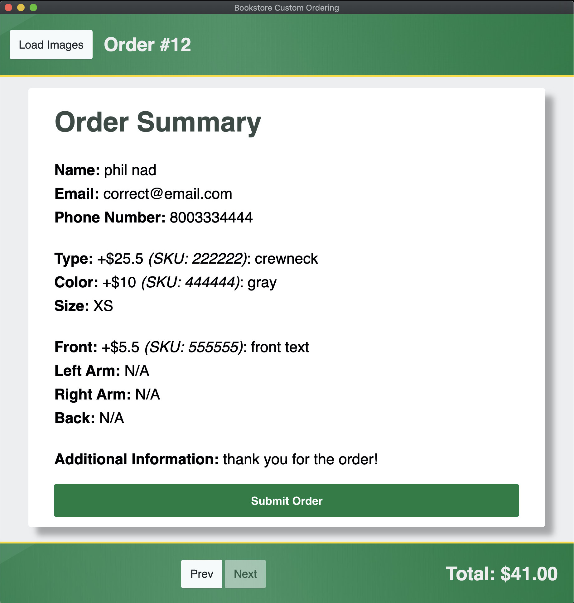

# The Summary Page

The `Summary` page allows you to review all the customizations entered during the order, as well as the SKU and price associated with them, and the text entered. *It is important that you review the Summary page to ensure that the information was entered correctly*. The information is sorted in the order you would normally enter the information, and grouped in categories for easier viewing. If a customization was not entered, instead of a SKU, price and text you will see `N/A`.

